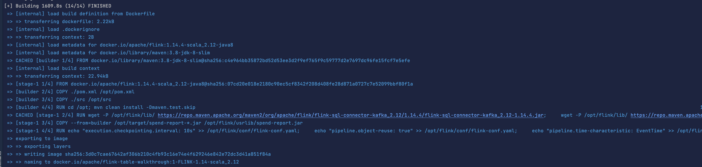
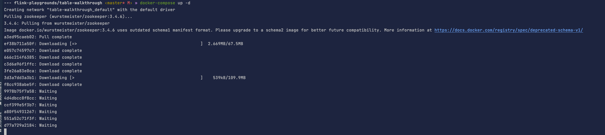
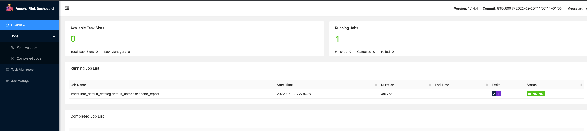
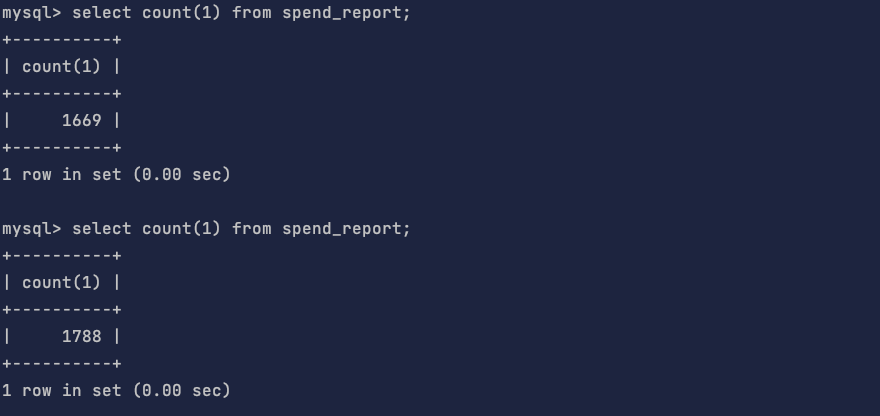
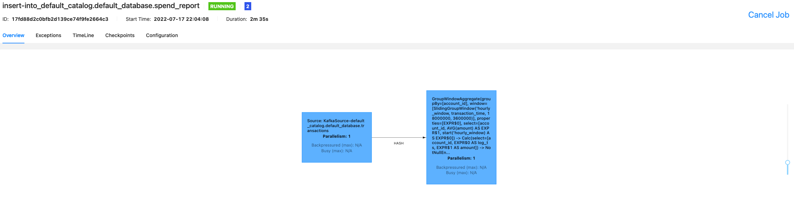

### 代码环境
配置文件位于 flink-playgrounds 仓库中，首先检出该仓库并构建 Docker 镜像：
```shell
git clone  https://github.com/apache/flink-playgrounds.git

cd flink-playgrounds/table-walkthrough
```

### 实现代码在SendReport#report方法

在开始运行之前先在 Docker 主机上创建检查点和保存点目录 （如果不做这一步有可能报错）:
```shell
mkdir -p /tmp/flink-checkpoints-directory
mkdir -p /tmp/flink-savepoints-directory
```

编译打包代码（本地打开Docker后，在flink-playgrounds/table-walkthrough目录下执行）
```shell
docker-compose build
```


启动环境：
```shell
docker-compose up -d
```


验证是否启动成功：
http://localhost:8082/


检查mysql是否在生成数据：


最后结果：



